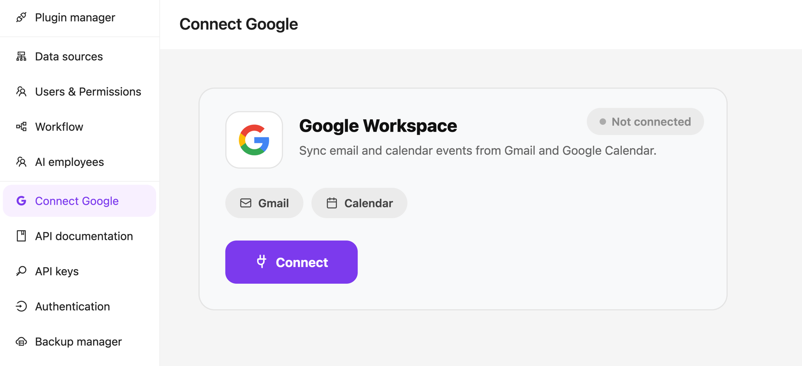

# @kalpak44/plugin-noco-tools

[](https://noco-ai-tools.pavel-usanli.online/)
[](https://opensource.org/licenses/MIT)
[](https://github.com/kalpak44/plugin-noco-tools/releases)

Connect your **NocoBase** app (and its **AI employees**) to **Google Gmail** and
**Google Calendar** via user-consented OAuth.

The plugin ships:

- A **"Connect Google" block** you can drop on any page — one-click OAuth in a popup, shows the connected account and lets the user reconnect / disconnect.
- A **public OAuth callback endpoint** that Google can hit directly (no NocoBase login required for the redirect itself).
- **Automatic token rotation** — access tokens are refreshed transparently before every Gmail/Calendar call using the stored refresh token, so AI agents can keep acting on the user's behalf without re-prompting for consent.
- **REST endpoints** for the operations any HTTP client can call: list/get/send emails, list/create events, list events on shared calendars.
- **AI-plugin tool registration** — if the NocoBase AI plugin is enabled, the same operations are automatically exposed as tools any AI employee can call.
- Credentials come from NocoBase **Variables and Secrets** (not from files), so you can rotate them centrally.

## Contents

- [Install](#install)
- [Configure — Google Cloud Console](#configure--google-cloud-console)
- [Configure — NocoBase Variables and Secrets](#configure--nocobase-variables-and-secrets)
- [Use the block](#use-the-block)
- [Use with AI employees](#use-with-ai-employees)
- [REST endpoints](#rest-endpoints)
- [Token rotation & lifecycle](#token-rotation--lifecycle)
- [Uninstall / privacy](#uninstall--privacy)
- [Develop](#develop)
- [Build](#build)

## Install

1. Grab a release `.tgz` (or build it yourself — see [Build](#build)).
2. Copy the `.tgz` to your NocoBase app's `./storage/plugins/` directory.
3. In NocoBase go to **Plugin Manager** (URL: `/v/admin/`), find **Noco Tools — Google (Gmail + Calendar)** and **Enable** it.

> **NocoBase compatibility:** `>=1.6.0` (modern client-v2). This plugin does **not** register anything under the legacy `/admin/...` plugin manager.

## Configure — Google Cloud Console

You'll need a Google Cloud project with the Gmail + Calendar APIs enabled and an OAuth 2.0 client. Handy shortcuts:

- Cloud Console home: <https://console.cloud.google.com/>
- List / switch projects: <https://console.cloud.google.com/cloud-resource-manager>
- Create a new project: <https://console.cloud.google.com/projectcreate>
- API Library (enable Gmail / Calendar): <https://console.cloud.google.com/apis/library>
- Google Auth Platform (overview / start here for auth setup): <https://console.cloud.google.com/auth/overview>
- OAuth branding (app name, support email, logo): <https://console.cloud.google.com/auth/branding>
- OAuth data access (scopes): <https://console.cloud.google.com/auth/scopes>
- OAuth audience (test users / publish to production): <https://console.cloud.google.com/auth/audience>
- OAuth clients (create / manage OAuth Client IDs): <https://console.cloud.google.com/auth/clients>
- Credentials (legacy view of the same clients + API keys): <https://console.cloud.google.com/apis/credentials>

Then:

1. Open the **Credentials** page (link above) and make sure you're in the right project (top-left project picker).
2. **Create OAuth Client ID** → **Web application**.
3. Add an **Authorized redirect URI**. The value is always your app's public origin plus the fixed suffix `/api/googleConnections:callback`:

   ```
   <YOUR_APP_URL>/api/googleConnections:callback
   ```

   Examples:
   ```
   http://localhost:13000/api/googleConnections:callback           # local dev
   https://nocobase.mycompany.com/api/googleConnections:callback   # production behind a domain / reverse proxy
   ```

   > **Important:** whatever URL you register here must **exactly** match the value of the `google_redirect_uri` variable you'll set in NocoBase next. If they differ, Google returns `redirect_uri_mismatch`.

4. In **APIs & Services → Library** enable:
   - **Gmail API**
   - **Google Calendar API**

5. In **Google Auth Platform → Data Access** (<https://console.cloud.google.com/auth/scopes>), click **Add or Remove Scopes** and add:
   - `openid`, `email`, `profile`
   - `https://www.googleapis.com/auth/gmail.modify` — read, send, modify, and delete emails on the user's behalf (does not include Trash → Delete forever).
   - `https://www.googleapis.com/auth/calendar` — read/write access to the user's calendars and events (including calendars shared with them).

   > **Why the broader scopes?** `gmail.modify` covers reading, sending, replying, labelling, and trashing in a single grant — one consent prompt instead of two, and lets the AI employee mark emails as read after processing. Same idea for `calendar`: read + create in one grant, and it grants access to shared calendars.
   > If the app is in **Testing**, Google only shows scopes to the user that are declared here. Skip this step and the consent screen will only ask for `email/profile`, and any Gmail/Calendar call will 403.

   > While the app is in **Testing**, add every NocoBase user you want to connect as a **Test user**. Publish the OAuth consent screen for broader access.

6. Copy the **Client ID** and **Client Secret** — you'll paste them into NocoBase next.

## Configure — NocoBase Variables and Secrets

Requires the built-in **Variables and Secrets** plugin (enabled by default in recent NocoBase releases). Go to **Settings → Variables and secrets** and add:

| Name                  | Kind     | Value                                            |
| --------------------- | -------- | ------------------------------------------------ |
| `google_client_id`    | Variable | The OAuth Client ID from Google Cloud Console.   |
| `google_client_secret`| Secret   | The OAuth Client Secret from Google Cloud Console. |
| `google_redirect_uri` | Variable | Full callback URL, e.g. `https://nocobase.mycompany.com/api/googleConnections:callback`. Must **exactly** match the Authorized redirect URI on your Google OAuth client. |

If you can't or don't want to use Variables & Secrets, the plugin falls back to environment variables of the same names in upper case:

- `GOOGLE_CLIENT_ID`
- `GOOGLE_CLIENT_SECRET`
- `GOOGLE_REDIRECT_URI`

**Verify configuration** at any time:

```
POST /api/googleTools:configStatus
```

Returns `{ configured: true, redirectUri, clientIdSuffix }` when the plugin can resolve credentials.

## Use the block

1. Open any Modern-UI page (`/v/...`).
2. **Add block** → **Others** → **Connect Google**.
3. Click **Connect Google** in the block. A popup opens the Google consent screen; on success the popup closes automatically and the block flips to **Connected as `<your email>`**.
4. **Disconnect** revokes the tokens with Google and removes the row from `googleConnections`.

The block appears in **Settings → Connect Google** and looks like this:



## Use with AI employees

If the [NocoBase AI plugin](https://docs.nocobase.com/handbook/ai) is enabled, this plugin registers these tools with `aiManager.toolsManager` on load:

| Tool name                        | Purpose                                                  |
| -------------------------------- | -------------------------------------------------------- |
| `googleGmailListEmails`          | List emails (Gmail search query, `maxResults` up to 50). |
| `googleGmailGetEmail`            | Read one email (headers + text + HTML bodies).           |
| `googleGmailSendEmail`           | Send an email on the connected user's behalf.            |
| `googleCalendarListCalendars`    | List every calendar the user owns or has access to.      |
| `googleCalendarListEvents`       | List events on a specific calendar (default: `primary`). |
| `googleCalendarCreateEvent`      | Create an event (optionally invite attendees).           |
| `googleCalendarUpdateEvent`      | Partial-update an existing event (reschedule / edit).    |
| `googleCalendarDeleteEvent`      | Cancel / delete an event (optionally notify attendees).  |
| `googleCalendarListSharedEvents` | List events across calendars **shared** with the user.   |

Bind them to an AI employee in **Settings → AI → Employees → Tools**. Tools run in the caller's user context, so each employee acts on behalf of the user who is chatting with it — no shared service account.

> **Summarization** is intentionally not a separate tool. The employee should call `googleGmailGetEmail` and summarize the returned body itself — that leaves the whole email visible in the conversation and doesn't hard-code a summarization prompt.

See the [website's System Prompt example](https://noco-ai-tools.pavel-usanli.online/#system-prompt) for a ready-to-paste prompt with worked examples of every call shape.

## REST endpoints

Even without the AI plugin, everything is callable over HTTP. All endpoints are `POST` unless noted; auth = logged-in NocoBase user; body = JSON `{ "values": {...} }`.

| Endpoint                                | Body / query                                    | Returns                          |
| --------------------------------------- | ----------------------------------------------- | -------------------------------- |
| `POST /api/googleConnections:authorize` | —                                               | `{ authorizeUrl, redirectUri }`  |
| `GET  /api/googleConnections:callback`  | `?code&state` (called by Google, **public**)    | HTML page + `postMessage` to opener |
| `GET  /api/googleConnections:status`    | —                                               | `{ connected, googleEmail, scopes, expiresAt, status }` |
| `POST /api/googleConnections:disconnect`| —                                               | `{ connected: false }`           |
| `POST /api/googleTools:configStatus`    | —                                               | `{ configured, redirectUri, clientIdSuffix }` |
| `POST /api/googleTools:listEmails`      | `{ values: { query?, maxResults?, labelIds? } }` | Array of email summaries         |
| `POST /api/googleTools:getEmail`        | `{ values: { id } }`                             | Email detail + bodies            |
| `POST /api/googleTools:sendEmail`       | `{ values: { to, subject, body, cc?, bcc?, isHtml?, replyToMessageId? } }` | `{ id, threadId }` |
| `POST /api/googleTools:listCalendars`   | —                                                | Array of calendars               |
| `POST /api/googleTools:listEvents`      | `{ values: { calendarId?, timeMin?, timeMax?, q?, maxResults? } }` | Array of events |
| `POST /api/googleTools:createEvent`     | `{ values: { summary, start, end, description?, location?, attendees?, calendarId?, sendUpdates? } }` | Event |
| `POST /api/googleTools:listSharedEvents`| `{ values: { timeMin?, timeMax?, q?, maxResults? } }` | Events on shared calendars |

## Token rotation & lifecycle

- **Refresh tokens** are requested with `access_type=offline` and `prompt=consent`, and stored in the `googleConnections.refreshToken` column with NocoBase's `encryption` field type (encrypted at rest by NocoBase).
- Every Gmail/Calendar call goes through `ensureFreshAccessToken(userId)` — if the current access token expires within 60 seconds it is refreshed against `oauth2.googleapis.com/token` first, and the new token is persisted.
- Google normally does **not** return a new refresh token on refresh; the existing one is kept. If Google ever revokes it (user removed the app from their Google Account), the row is marked `status=error` and the block prompts the user to reconnect.
- On **disconnect**, both the access token and refresh token are revoked with Google, then the row is deleted.

## Uninstall / privacy

**By default, tokens are erased when the plugin is disabled or uninstalled.** Concretely:

- `afterDisable()` — revokes and deletes every row in `googleConnections`.
- `remove()` — same, then the collection's table is dropped by NocoBase.

If you'd like tokens to survive a disable/re-enable cycle, comment out `afterDisable()` in `src/server/plugin.ts` and rebuild.

## Develop

The repo is set up as a **standalone plugin package with a local dev app**:

```bash
# 1. Bootstrap a local NocoBase dev instance under ./app (gitignored).
#    This step is only needed once per machine, and takes a few minutes.
yarn bootstrap   # or: npm run bootstrap

# 2. Iterate on the plugin. The dev script starts NocoBase watching
#    /src changes.
yarn dev
```

The bootstrap script does the equivalent of:

```bash
mkdir -p app && cd app
nb init --skip-ui           # non-interactive install of a NocoBase source app
ln -s ../.. plugins/@kalpak44/plugin-noco-tools
nb plugin enable @kalpak44/plugin-noco-tools
```

## Build

Produces a `.tgz` you can drop into any NocoBase instance's `./storage/plugins/`.

```bash
yarn build
# → dist/kalpak44-plugin-noco-tools-<version>.tgz
```

The build script:

1. Ensures the local dev app is bootstrapped.
2. Runs `nb source build @kalpak44/plugin-noco-tools --tar`.
3. Copies the resulting tarball from `app/source/storage/tar/` to `./dist/` at the repo root.

CI: `.github/workflows/build.yml` runs the same on every tag push and uploads the `.tgz` as a release asset.

## License

MIT © kalpak44